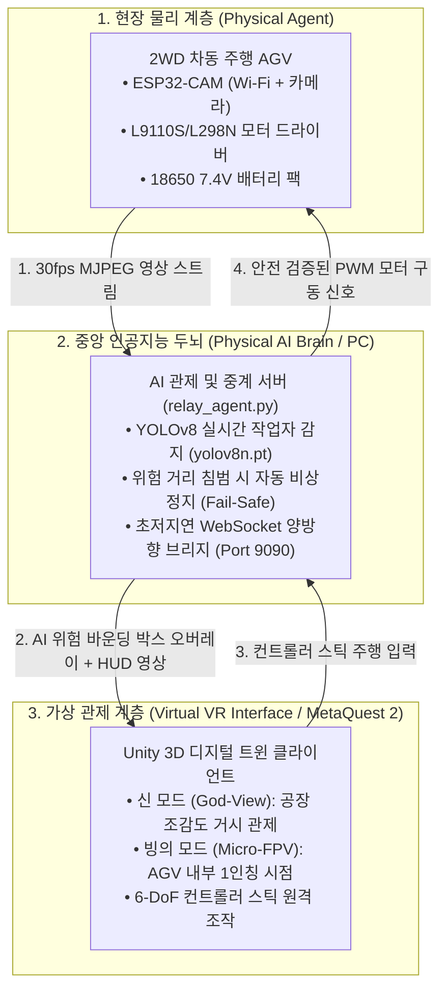

# [마스터 보고서] 2026 제4회 경남 AI·SW 경진대회: MetaQuest2 VR 기반 피지컬 AI Agent

---

## 1. 프로젝트 개요 및 핵심 과제 정의
* **대회명**: 2026 제4회 경남 AI·SW 경진대회
* **주관/과제**: 경상국립대(글로컬사업단) - **MetaQuest2 VR 기반 피지컬 AI Agent**
* **과제명**: 스마트물류 AGV 실시간 1인칭 FPV 빙의 운전(Teleoperation) 및 협착 재해 방지 피지컬 AI 시스템
* **달성 완성도**: 8일 단기 집중형 **Level 3 (MVP)** (End-to-End 단일 워크플로우 + 핵심 기능 4종)

---

## 2. 전체 시스템 아키텍처 및 데이터 흐름



---

## 3. 기제작 완료된 소프트웨어 및 펌웨어 자산 목록

| 영역 | 파일 경로 | 완성 내용 | 검증 상태 |
| :--- | :--- | :--- | :--- |
| **ESP32 펌웨어** | `hardware_firmware/esp32_cam_car/esp32_cam_car.ino` | Wi-Fi AP/STA 자동 전환, MJPEG 스트리머(81번 포트), WebSocket 모터 제어(80번 포트) | 완료 |
| **아두이노 펌웨어** | `hardware_firmware/arduino_uno_motor/arduino_uno_motor.ino` | 시리얼 통신(115200 bps) 기반 L298N 차동 구동 및 타임아웃 워치독 | 완료 |
| **배선 및 전원 명세** | `hardware_firmware/pinout_wiring_guide.md` | 공통 접지(Common GND), 18650 전원 분리, GPIO 매핑 가이드 | 완료 |
| **AI 중계 서버** | `ai_relay_server/relay_agent.py` | YOLOv8 안전 관제, Shared Autonomy 충돌 회피, 소켓 중계 | 완료 |
| **AI 모델 가중치** | `ai_relay_server/yolov8n.pt` | YOLOv8 nano 가중치 사전 캐싱 완료 (6.5MB) | 완료 |
| **무하드웨어 검증기** | `ai_relay_server/test_mock_hardware.py` | VR 컨트롤러 조작 5단계(전진/회전/정지/빙의) 모의 에뮬레이터 | **100% 통과** |
| **유니티 소켓 매니저** | `meta_quest_unity/Scripts/WebSocketManager.cs` | .NET 표준 비동기 ClientWebSocket, 논블로킹 큐 | 완료 |
| **유니티 FPV 수신** | `meta_quest_unity/Scripts/FPVStreamReceiver.cs` | Texture2D 실시간 프레임 디코딩 및 UI/3D Quad 렌더링 | 완료 |
| **유니티 컨트롤러 입력**| `meta_quest_unity/Scripts/AGVControllerInput.cs` | 메타퀘스트 2 스틱 및 에디터 키보드(WASD) 겸용 차동 매핑 | 완료 |
| **유니티 시점 전환기** | `meta_quest_unity/Scripts/PerspectiveSwitcher.cs` | 거시(God-View) ↔ 1인칭 FPV(빙의) 스무스 트랜지션 | 완료 |

---

## 4. 수행 완료된 사전 준비 및 최적화 성과

1. **디스크 용량 확보**:
   - NPM 캐시(4.75GB), Pip 빌드 캐시(0.78GB), Temp 임시파일(891개) 일괄 정리.
   - C 드라이브 여유 공간 35.53GB $\rightarrow$ **42.08GB (+6.5GB 확보)** 성공.
2. **독립 Python AI 환경 구축**:
   - 윈도우 260자 경로 제한(WinError 206) 원천 차단: `C:\Users\hun\ai_env` 독립 가상환경 생성.
   - PyTorch CPU 경량 버전, Ultralytics YOLOv8, OpenCV, WebSockets 탑재 완료.
3. **통신 파이프라인 무하드웨어 시뮬레이션 합격**:
   - `test_mock_hardware.py` 실행 결과:
     * 전진 명령 (`DRIVE, left=200, right=200`) 전달 성공.
     * 좌회전/우회전 차동 조향 명령 전달 성공.
     * 비상 정지 (`STOP`) 전달 성공.
     * 거시-미시 시점 전환 (`TELEPORT, mode=MICRO_FPV`) 전달 성공.
4. **Unity Hub 정식 Win32 설치 완료**:
   - `UnityHubSetup-x64.exe` 설치 완료 (`C:\Program Files\Unity Hub\Unity Hub.exe`).

---

## 5. 유니티 에디터 라이선스 정밀 진단 및 원포인트 해결법

### [현상 및 원인 분석]
* `2022.3.76f1` 에디터를 설치하였으나, 실행 시 `return code 198`로 종료됨.
* 로그 분석 결과:
  ```text
  This build of Unity 2022 is part of an Extended LTS release, which requires either a valid Unity Industry or Unity Enterprise license.
  ```
* **원인**: 버전 번호 2022.3.70대 이후는 유료 기업용(Industry/Enterprise) '확장된 LTS(Extended LTS)' 전용 버전으로, 무료 Personal 라이선스는 실행이 차단됨.

### [원포인트 해결 조치 (사용자가 할 일: 1분)]
1. **Unity Hub 실행** $\rightarrow$ 좌측 **'설치(Installs)'** 메뉴 이동.
2. 설치된 `2022.3.76f1` 우측 점 세 개(`...`) 클릭 $\rightarrow$ **'제거(Uninstall)'** 클릭 (디스크 18.7GB 즉시 복구).
3. 우측 상단 파란색 **'에디터 설치(Install Editor)'** 클릭.
4. **첫 번째 탭 '정식 릴리스(Official Releases)'** 선택.
5. 상단에 표시되는 **`Unity 6 (6000.0.x LTS)`** 옆 **'설치'** 클릭.
6. `Android Build Support` 체크 확인 후 완료.
*(Unity 6000.0 LTS는 Personal 무료 라이선스를 완벽 지원하며, Meta Quest 2 공식 SDK와 100% 호환됩니다).*
