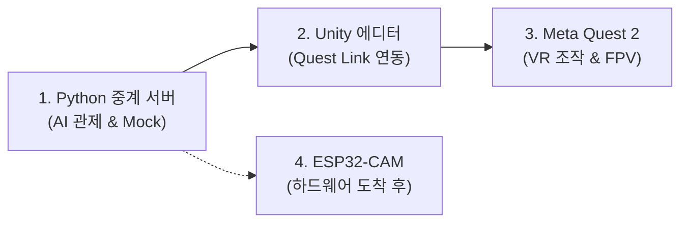

# 피지컬 AI 메타퀘스트 VR AGV: 종합 초기 개발환경 세팅 가이드

하드웨어 부품 배송 전에도 PC와 유니티만으로 전체 시스템을 검증하고, 부품 도착 즉시 동작시킬 수 있도록 구성된 표준 환경설정 가이드입니다.

---

## 1. 단계별 개발 환경 세팅 요약



---

## 2. 세부 파트별 초기 세팅 가이드

### [파트 1] 파이썬 AI 관제 중계 서버 (PC)
* **요구 사항**: Python 3.10 또는 3.11
* **세팅 절차**:
  ```powershell
  # 1. 중계 서버 폴더로 이동
  cd "5_경남2026_피지컬AI_메타퀘스트VR_AGV\ai_relay_server"

  # 2. 가상환경 생성 및 활성화
  python -m venv venv
  .\venv\Scripts\Activate.ps1

  # 3. 필수 패키지 설치
  pip install -r requirements.txt
  ```

---

### [파트 2] 아두이노 IDE 세팅 (하드웨어 펌웨어 준비)
1. **아두이노 IDE 2.x** 설치.
2. **ESP32 보드 매니저 URL 추가**:
   - `파일` $\rightarrow$ `기본 설정(Preferences)` $\rightarrow$ **추가 보드 매니저 URLs**에 아래 주소 입력:
     `https://raw.githubusercontent.com/espressif/arduino-esp32/gh-pages/package_esp32_index.json`
3. **보드 패키지 설치**:
   - `도구` $\rightarrow$ `보드` $\rightarrow$ `보드 매니저` 검색창에 **esp32** 입력 후 설치 (`esp32 by Espressif Systems`).
4. **보드 선택**:
   - `도구` $\rightarrow$ `보드` $\rightarrow$ `esp32` $\rightarrow$ **AI Thinker ESP32-CAM** 선택.
5. **필수 라이브러리 ZIP 등록**:
   - `ESPAsyncWebServer` 및 `AsyncTCP` 라이브러리 설치 (GitHub ZIP 다운로드 후 `스케치` $\rightarrow$ `라이브러리 포함하기` $\rightarrow$ `.ZIP 라이브러리 추가`).

---

### [파트 3] 유니티(Unity) & 메타퀘스트 연동 준비
1. **Unity 2022.3 LTS** 설치 (Unity Hub 이용).
   - 설치 옵션에서 **Android Build Support** 꼭 체크.
2. **Meta Quest Link PC 앱** 설치 및 기기 페어링.
3. Unity 에디터에서 본 프로젝트의 `meta_quest_unity/Scripts` 폴더 내 C# 파일들을 프로젝트 에셋으로 임포트.

---

### [파트 4] 네트워크 및 방화벽 설정 (매우 중요)
* PC와 Meta Quest 2, ESP32-CAM은 **반드시 동일한 Wi-Fi 네트워크(같은 공유기/핫스팟)**에 물려 있어야 합니다.
* PC IP 확인:
  ```powershell
  ipconfig
  ```
  (예: `192.168.0.25` 확인 후 Unity의 `WebSocketManager.cs`의 Server Uri에 `ws://192.168.0.25:9090` 입력).
* **윈도우 방화벽 포트 허용**: 포트 `9090` (WebSocket) 인바운드 허용 확인.

---

## 3. [즉시 실행] 하드웨어 없이 전체 파이프라인 검증하기 (Mock 모드)

부품이 도착하지 않아도 지금 당장 전체 통신 구조를 100% 테스트할 수 있습니다.

```powershell
# 터미널 1: 가상 중계 서버 실행 (웹캠 또는 가상 화면 송출)
cd "5_경남2026_피지컬AI_메타퀘스트VR_AGV\ai_relay_server"
python relay_agent.py --mock --no-ai

# 터미널 2: 가상 VR 조작 입력 테스트
python test_mock_hardware.py
```

* 정상 작동 시: 터미널 1에 `[Mock Car] Received Drive Command -> Left: 200, Right: 200` 로그가 실시간 출력됩니다.
