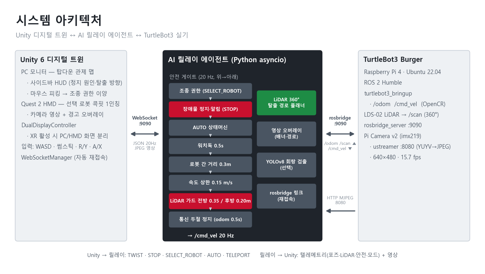

# [개발완료보고서] MetaQuest VR 피지컬 AI AGV 디지털 트윈

**대회**: 2026 제4회 경남 AI·SW 경진대회  
**신청 구분 / 분야**: 대학부 (국립한국해양대학교) / 32 — 제조 피지컬 AI (MetaQuest2 VR 기반 피지컬 AI Agent)  
**작품명**: 멈추고, 알리고, 사람이 빼낸다 — VR 원격 개입형 AGV 협착 방지 디지털 트윈  
**팀명**: [팀명]  
**팀장 / 팀원**: [팀장명] / [팀원명]  
**완성도**: Level 3 MVP — 실물 TurtleBot3 2대 연동, 입력→판단→Tool→실물 반응 E2E 동작  
**제출일**: 2026-10-06

<!-- pagebreak -->

## 1. 프로젝트 현황
| 항목 | 내용 |
|---|---|
| 제목 | MetaQuest VR 기반 피지컬 AI 원격 개입 & AGV 협착 방지 디지털 트윈 |
| 요약 | 2D LiDAR·카메라만 단 보급형 AGV가 위험하면 스스로 멈추고, 정지 원인과 LiDAR로 계산한 탈출 경로를 화면에 그려 관제사를 부른다. 관제사가 지도에서 로봇을 누르면 VR 착용자가 그 로봇 운전석으로 들어가 빼낸 뒤 자율 순찰을 다시 맡긴다. |
| 신청구분 / 분야 | 대학부 / 32 (3-2. 제조 피지컬 AI — MetaQuest2 VR 기반 피지컬 AI Agent) |
| 팀 | [팀명] (국립한국해양대학교) |
| 팀원·역할 | [팀장명]: [역할] / [팀원명]: [역할] |
| 저장소 | https://github.com/hun1105/gohst_rider (공개, 브랜치 `agent/claude`), 제출 ZIP `source_code.zip`. 실행 순서 `launch/README.md` |

## 2. 프로젝트 개요

### 2.1 문제
- **사람과 로봇이 같은 동선을 쓰는 곳에서 사고는 끼임·부딪힘에 몰린다.** 2011~2020년 산업용 로봇 재해자 355명 중 끼임 53%(187명), 부딪힘 34%(121명)[1]. 2024년 끼임 사고사망자는 66명으로 전년보다 22.2% 늘었다[2].
- **멈춘 라인은 돈이다.** 비계획 정지 비용은 자동차 라인 시간당 최대 230만 달러, 소비재(FMCG) 라인 시간당 3.6만 달러이며, 글로벌 500대 기업 기준 연간 1.4조 달러(매출의 11%)에 이른다[3].
- **보급형 AGV의 구조적 한계 ① 높이 사각지대**: 2D LiDAR는 한 평면(Burger 기준 바닥 약 0.17m)만 본다. 3D LiDAR는 중소 현장에 부담이 크다.
- **② 자율 후진의 역설**: 후방 감지 없이 스스로 물러나면 뒤쪽 보행자를 칠 수 있어, 결국 비상정지 후 통로가 막힌다.
- **③ 물리적 출동**: 멈춘 로봇은 관리자가 현장까지 걸어가 조작해야 풀린다. 그동안 같은 통로의 흐름이 막힌다. 로봇 분야는 이 부담을 사람 개입 간 평균 시간(MTBI)으로 측정하고[6], AGV 인수 시험도 가용률을 평가 항목으로 둔다[7].

### 2.2 사용자
- **관제사**(PC): 여러 AGV를 지도로 보며 멈춘 로봇을 고른다.
- **원격 조작자**(Meta Quest 2): 고른 로봇의 1인칭 운전석에서 직접 빼낸다.
- **현장 작업자**: AGV와 같은 통로를 쓰는 보호 대상.

### 2.3 목표
- AGV 2대 운용 중 작업자 협착·충돌 0건, 봉착 시 현장 출동 없이 원격으로 무사고 탈출.
- 판단은 로봇이 하되(정지·경로 계산), 움직임 결정은 근거를 본 사람이 내린다.

## 3. 개발 세부 내용

### 3.1 시스템 구조

*그림 1. 시스템 아키텍처 — 안전 게이트를 통과한 속도만 /cmd_vel로 나간다 (20 Hz)*

- **3 Tier**: ① 현장(Physical Field) — TurtleBot3 2대·LiDAR·카메라 ② AI 릴레이(Agent) — 20 Hz 판단·안전 게이트·경로 계산 ③ 디지털 트윈·VR — Unity 관제 맵·Quest 콕핏.

| 구분 | 구성 | 실측·설정값 |
|---|---|---|
| 로봇 2대 | TurtleBot3 Burger — TB1 ROS 1 Noetic, TB2 ROS 2 Humble | 속도 상한 0.15 m/s (제원 0.22) |
| 센서 | LDS-02 360° LiDAR (2대), Pi Camera v2 (TB2) | 전방 0.35m 전진 차단, 후방 0.20m 후진 차단, 영상 640×480 15.7 fps (CPU JPEG) |
| 통신 | rosbridge WebSocket ↔ Python asyncio 릴레이 ↔ Unity | 지령·텔레메트리 20 Hz, odom 0.5s 무수신 시 정지 |
| 트윈·VR | Unity 6 (URP, OpenXR 1.17), Meta Quest 2 | PC 탑다운 관제 맵 / HMD 콕핏 분리 출력 |

### 3.2 활용 데이터
- **실시간 센서**: LiDAR 360° 스캔(LD08 무효값 0.0 제외, 0.12m 하한), 휠 오도메트리, 카메라 영상. 학습용 데이터 수집·라벨링 없음.
- **사전학습 모델**: YOLOv8n (COCO 가중치, 회랑 검출 인터록 — 현장 미검증, 실시간 판단은 LiDAR 주도).
- **운행 이력**: 릴레이 이벤트 로그 + 1 Hz 텔레메트리 JSONL (정지 원인·모드·경로 신뢰도).

### 3.3 AI·Tool·알고리즘
| Agent 요소 | 구현 |
|---|---|
| Goal | 협착·충돌 0건, 봉착 시 무사고 탈출 |
| Planning | 순찰(AUTO) → 위험 감지 → 인터록 정지 → 탈출 경로 산출 → 수동 개입 → AUTO 재개 |
| Reasoning | LiDAR 섹터 거리, 로봇 폭 회랑 탈출 방향, 곡률 원호 궤적, 로봇 간 거리, YOLOv8 |
| Tool Use | ROS `/cmd_vel`·`/odom`·`/scan`(rosbridge), ustreamer 카메라, WebSocket, Unity |
| Memory | 로봇별 AUTO/MANUAL·상태, 정지 원인, 배회 원점, 위치 원점, 운행 이력 |
| Feedback | 영상 경로 띠·선회 화살표·적색 배너, 지도 적색 차체·원판, 사이드바, 컨트롤러 진동 |

**정지·탈출 판단 (조건 → 방법 → 결과)**: 조건 — 전방 LiDAR < 0.35m 또는 로봇 간 중심 거리 < 0.3m이면 전진 지령 0, 정지·알림. 방법 — 5° 간격 72방향마다 로봇 폭 회랑의 여유 d(h)를 재고 0.5m 미만은 버린 뒤 `d(h) − 0.25·|h|` 최대 방향 선택. 결과 — 그 방향을 카메라 영상 바닥에 경로 띠·선회 화살표로 그리고, 전진은 막은 채 후진(후방 0.20m 가드)·회전은 사람이 조작.

| 기능 | 알고리즘 | 핵심 식·파라미터 |
|---|---|---|
| 탈출 방향 | 후보 방향 샘플링 + 로봇 폭 회랑 (VFH[4]·Follow-the-Gap[5] 계열) | 5° 간격 72방향, `d<0.5m` 제외, `J = d − 0.25·\|h\|` 최대 |
| 추천 궤적 | 곡률 샘플링 (DWA 계열) | κ ∈ [−3, 3] 25개, 1.2m 원호, 반경 0.13m 충돌 검사, 녹/노/적 신뢰도 |
| 선회 추천 | 전진 전무 시 탈출 방향 제자리 선회 + 직진 | 회전 공간 0.16m 확인 |
| 영상 투영 | 핀홀 카메라 모델 | 렌즈 0.16m, 62.2°×48.8°, `u = cx − fx·y/z` |
| AUTO | 로봇별 상태기계 | 기본 직진 0.10 m/s → 안전 조건 시 STUCK (회피·복귀는 `--auto-steer` 선택) |

### 3.4 단계별 개발 내용
| 단계 | 내용 |
|---|---|
| 1. 기반 | 메시지 규격(PROTOCOL.md), 릴레이 골격, Unity 트윈 씬 자동 생성 |
| 2. 실물 연동 | rosbridge 다중 로봇 링크(ROS 1·2 혼용), 속도 상한·LiDAR 가드·통신 두절 정지, 카메라 스트림 |
| 3. 안전 판단 | 자동 후진 삭제 → 정지·알림 인터록, LiDAR 탈출 경로, 로봇별 AUTO, 로봇 간 만남 둘 다 정지 |
| 4. 원격 개입 | 탑다운 관제 맵, 클릭 빙의, PC·HMD 분리, 그립 데드맨·양손 조작·진동, 영상 위 경로 투영 |
| 5. 검증 | 가짜 rosbridge E2E 자동 시험 78항목, 실물 TB1·TB2 기동·토픽·주행 확인 |

## 4. 구현 결과

### 4.1 핵심 기능
- **자율 후진 없는 정지·알림**: 위험 시 즉시 정지, 전진만 막고 후진·회전은 사람에게. 후진은 후방 0.20m 가드가 지킨다.
- **경로를 화면에 그린다**: 추천 궤적·선회 방향을 카메라 영상 바닥과 관제 맵에 표시, 돌아야 할 쪽 손 컨트롤러만 진동.
- **클릭 한 번으로 원격 개입**: 관제 맵 클릭 → 그 로봇 콕핏으로 즉시 전환(그 로봇만 MANUAL) → 그립 데드맨 + 좌 스틱 선회·우 스틱 직진/후진.
- **AGV 2대 자율 순찰과 만남 처리**: 각자 AUTO, 0.3m 안에서 만나면 둘 다 정지, 사람이 한 대를 골라 비켜준다.

 

*그림 2. 좌: 콕핏 영상 위 경로·정지 배너, 우: 관제 맵 적색 경고 (촬영 캡처)*

### 4.2 대표 테스트 5건 (현장 운영 시나리오)
자동 시험 `test_real_bridge.py` 78항목 전부 통과, 같은 시험 10회 반복 무결점, 300초 부하 시험 안전 위반 0건 (가짜 rosbridge 2대가 실기와 같은 odom·scan 발행, 릴레이 `cmd_vel` 기록, 기록 `docs/evidence/`).

| 현장 시나리오 | 대응 TC |
|---|---|
| ① 정면 돌발 장애물 | TC-01 |
| ② AGV 대향 마주침 | TC-02 |
| ③ 관제 → VR 원격 개입 | TC-03 |
| ④ 원격 조종·통신 두절 | TC-04 |
| ⑤ AUTO 정지 후 수동 탈출 | TC-05 |

| TC | 시나리오 | 자동 시험 근거 | 실물 확인 | 결과 |
|---|---|---|---|---|
| TC-01 | 협착 방지: 전방 0.35m | 0.3m → STOP·원인 표시, 전진 0, 후진·회전 허용 | TB2 전진 차단 확인 | PASS |
| TC-02 | 타 AGV 0.3m 회피 | 2대 AUTO 만남 → 둘 다 STUCK·정지, 한 대 콕핏 진입·후진 비켜주기 | 실물 2대 시연 (촬영 시 기록) | 자동 PASS |
| TC-03 | God-View ↔ VR 콕핏 | 클릭 빙의·즉시 전환, Unity 컴파일 에러 0 | Quest 화면 표출·전환 확인 | PASS |
| TC-04 | Quest·키보드 → 실물 바퀴 | 0.22 지령 → 0.15 m/s 제한, 워치독 0.5s, 연결 해제 정지 | WASD·Quest 스틱 → TB2 주행 확인 | PASS |
| TC-05 | AUTO 봉착 → 수동 탈출 | 0.3m·막다른 길·6초 → STUCK, 자동 재개 없음, 입력 시 MANUAL | 촬영 리허설에서 기록 | 자동 PASS |

## 5. 기대효과

### 5.1 성과
- 3D LiDAR 없이 2D LiDAR·카메라·소프트웨어로 정지 판단과 원격 탈출을 구현했다 (보급형 AGV 개조형).
- 멈춘 로봇을 현장 출동 대신 관제석에서 바로 빼내 정지 시간을 줄일 수 있다. 판단 근거(정지 원인·경로)가 화면에 남아 사고 책임 추적에도 쓴다.
- ROS 1·ROS 2 로봇을 한 관제 화면에 묶어 1인 다대 관제가 가능하다.

### 5.2 기존 방식과 비교 (정성)
| 항목 | 보급형 AGV | 고가 자율 AMR | 본 시스템 |
|---|---|---|---|
| 정지 후 복구 | 관리자 현장 출동 | 자체 재탐색 (복잡 환경 교착 가능) | 관제석에서 VR 원격 개입 |
| 안전 판단 | 범퍼·2D 정지 | 3D 센서 자율 판단 | 정지 우선 게이트 + 사람 최종 판단 |
| 도입 방식 | 기체 도입 | 고가 센서 기체 신규 도입 | 기존 기체 + 소프트웨어 |

### 5.3 한계와 발전 로드맵
1. 비전 인터록(YOLOv8)은 현장 미검증, 실시간 안전 판단은 LiDAR가 맡는다. 2D LiDAR 높이 사각은 남는다.
2. 오도메트리 누적 오차 → 원점 마커 재설정(`P`)으로 보정, 향후 SLAM 위치 보정.
3. ROS 1 로봇은 통신 두절 시 마지막 속도 유지 여부가 펌웨어에 달려 있어 로봇 측 정지 감시 노드가 필요하다.
4. rosbridge는 인증이 없어 시연망을 분리해야 한다. 정지 시간 단축 효과(MTBI)는 현장 측정이 필요하다.
- **로드맵**: 깊이 카메라 융합으로 높이 사각 보완 → SLAM 위치 보정 → 다대 교착 시 우선순위 자동 판단(플릿 관리 연동).

### 출처
1. 안전보건공단(KOSHA) 산업용 로봇 재해 분석 2011~2020, 뉴스톱 「2023 중대재해 예방 팩트체크」(newstof.com) 인용.
2. 고용노동부, 「2024년 재해조사 대상 사망사고 발생현황」 잠정결과 (2025-03-11), 정책브리핑(korea.kr).
3. Siemens, 「The True Cost of Downtime 2024」.
4. J. Borenstein, Y. Koren, "The Vector Field Histogram," IEEE T-RA 7(3), 1991.
5. V. Sezer, M. Gokasan, "Follow the Gap Method," Robotics and Autonomous Systems 60(9), 2012.
6. "AutoInspect: Towards Long-Term Autonomous Industrial Inspection," arXiv:2404.12785, 2024 (MTBI 정의·장기 운용 사례).
7. VDI 2710 Blatt 5, 「Abnahmeregeln für Fahrerlose Transportsysteme (FTS)」 — AGV 인수 시험(가용률·성능), VDI.
