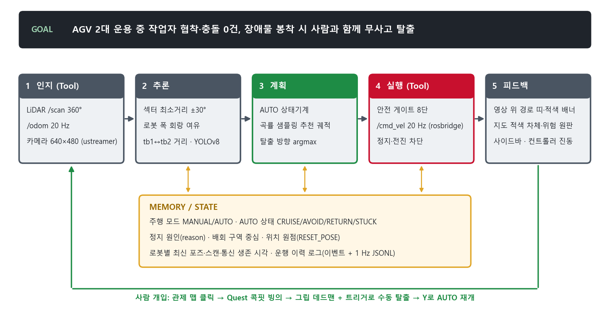

# [AI Agent 기술설명서] VR 원격 개입형 AGV 협착 방지 디지털 트윈

| 항목 | 내용 |
|---|---|
| 팀명/부문/주제 | [팀명] / 대학부 (국립한국해양대학교) / 32 제조 피지컬 AI — MetaQuest2 VR 기반 피지컬 AI Agent |
| 작품명 | 멈추고, 알리고, 사람이 빼낸다 — VR 원격 개입형 AGV 협착 방지 디지털 트윈 |
| 해결 문제 | 사람·AGV 혼재 통로의 끼임·부딪힘(산업용 로봇 재해 53%·34%, KOSHA 2011~2020), 2024년 끼임 사망 66명(+22.2%, 고용노동부). 멈춘 AGV는 현장 출동 전까지 라인 정체(정지 비용 자동차 시간당 최대 230만 달러, Siemens 2024) |
| 대상사용자 | 물류·제조 현장 AGV 관제사(PC), 원격 조작자(Meta Quest 2), 같은 통로를 쓰는 작업자 |
| Agent Goal | AGV 2대 협착·충돌 0건, 봉착 시 현장 출동 없이 원격으로 무사고 탈출 |
| 사용 AI/LLM/모델 | LiDAR 기하 추론(섹터 거리·로봇 폭 회랑 탈출 방향·곡률 원호 궤적, VFH·DWA 계열), 로봇별 AUTO 상태기계, YOLOv8n 회랑 검출(사전학습, 현장 미검증) |
| Tool/API/Data/장비 | TurtleBot3 Burger 2대(ROS 1 Noetic·ROS 2 Humble), LDS-02 LiDAR, Pi Camera v2, rosbridge(`/cmd_vel`·`/odom`·`/scan`), ustreamer, WebSocket 20 Hz, Unity 6 + OpenXR, Meta Quest 2 |
| Memory/State/Feedback | 로봇별 AUTO/MANUAL·상태·정지 원인, 배회 원점, 위치 원점(RESET_POSE), 운행 이력 로그(이벤트 + 1 Hz JSONL) / 영상 경로 띠·선회 화살표·적색 배너, 지도 적색 차체·원판, 컨트롤러 진동 |
| 핵심 Workflow | 입력(LiDAR·odom·조작) → 판단(정지·탈출 경로·만남) → Tool(rosbridge `/cmd_vel`) → 실행(실물 정지·주행) → 결과(트윈·영상 표시) → Feedback(관제 클릭 → VR 개입 → AUTO 재개) |
| 핵심기능 | ① 자율 후진 없는 정지·알림 인터록 ② LiDAR 탈출·선회 경로를 영상·지도에 표시 ③ 클릭 한 번 콕핏 빙의 + 그립 데드맨·양손 조작·진동 ④ AGV 2대 자율 순찰·1.0m 만남 둘 다 정지 ⑤ 속도 상한·LiDAR 가드·통신 두절 정지 |
| 기존자산/신규개발분 | 기존: TurtleBot3 차체·OpenCR 펌웨어·ROS 드라이버, rosbridge_server, ustreamer, YOLOv8 가중치, Unity·OpenXR. 신규(대회 기간 8일): 다중 로봇 rosbridge 릴레이, 안전 게이트·정지 인터록, 탈출·선회 경로 알고리즘·영상 투영, 로봇별 AUTO, VR 관제·콕핏·데드맨·진동, E2E 시험 73항목, 실행 스크립트 |
| 대표 테스트 5건 결과 | TC-01 0.35m 전진 차단 PASS · TC-02 2대 만남 둘 다 정지 자동 PASS · TC-03 God-View↔VR 전환 PASS · TC-04 Quest·키보드→실물 바퀴(0.15 m/s 제한) PASS · TC-05 AUTO 봉착→수동 탈출 자동 PASS |
| 완성도 Level | Level 3 (실물 2대 연동 MVP, E2E 동작) |
| 소스코드/저장소 경로 | `source_code.zip` — `ai_relay_server/`(릴레이·플래너·시험), `PhysicalAI_AGV_VR/Assets/Scripts/`(Unity), `launch/`(실행 bat·README), `docs/PROTOCOL.md`(메시지 규격) |
